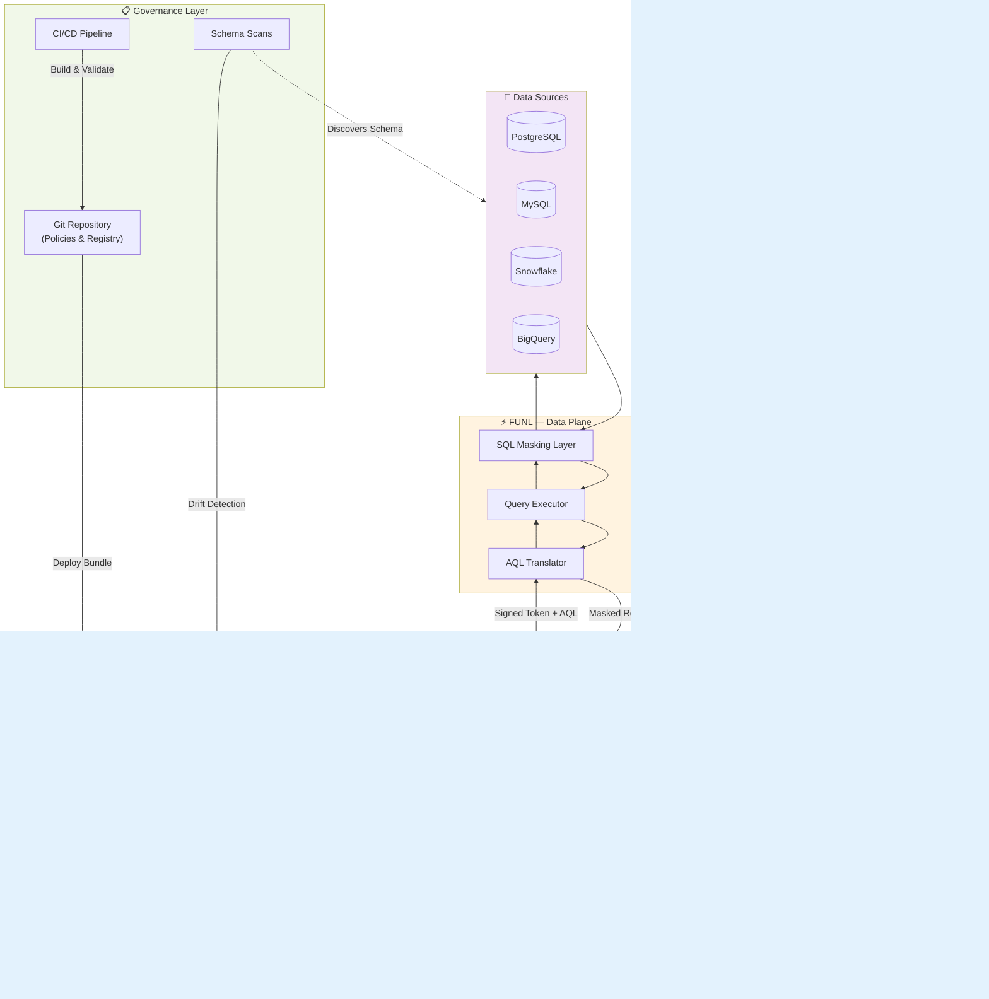

# VaultKit

[](https://opensource.org/licenses/Apache-2.0)
[]()
[]()
[](https://golang.org)
[](https://www.ruby-lang.org)

> A secure, policy-driven control plane for unified data access across heterogeneous data sources.

**TL;DR**: VaultKit prevents credential sprawl and enforces data access policies across databases. Write queries in AQL (vendor-neutral JSON), policies decide who sees what, FUNL executes safely. Schema changes require explicit review—no silent data exposure.

---

## 🎯 What is VaultKit?

VaultKit provides enterprise-grade governance and security for data access, enabling applications, engineers, and AI agents to query multiple data sources through a unified, policy-controlled interface.

VaultKit is a **control plane** that governs how data is accessed across your organization. It centralizes authentication, authorization, policy evaluation, and access control—ensuring that every data request is properly authenticated, authorized, and audited before execution.

### Core Responsibilities

- **Authentication & Authorization**: Identity verification and access control with RBAC/ABAC support
- **Policy Evaluation**: Fine-grained policies based on user attributes, data sensitivity, geographic regions, and time constraints
- **Data Masking**: Column-level masking rules (full, partial, hash) applied based on user clearance
- **Connection Management**: Centralized datasource configuration and credential management
- **Approval Workflows**: Require explicit approval for accessing sensitive datasets
- **Audit Logging**: Complete audit trail of every data access request
- **Metadata Catalog**: Automated dataset classification and schema discovery
- **Session Tokens**: Short-lived, cryptographically-signed tokens for Zero-Trust security
- **Schema Governance**: Git-backed policy bundles with drift detection for safe schema evolution

---

## ⚡ What is FUNL?

FUNL (Functional Universal Query Language) is the **data plane and execution engine** that powers VaultKit's query capabilities. While VaultKit decides *if* and *how* data can be accessed, FUNL handles the actual execution.

### Core Responsibilities

- **AQL Translation**: Converts VaultKit's Abstract Query Language (AQL) into native query languages
- **Multi-Engine Support**: Executes queries against PostgreSQL, MySQL, Snowflake, BigQuery, and more
- **SQL Masking Engine**: Applies column-level masking at the SQL execution layer
- **Query Execution**: Handles parameterized queries with injection prevention
- **Result Sanitization**: Returns masked and filtered results back to VaultKit
- **JWT Authentication**: Only accepts cryptographically-signed requests from VaultKit

FUNL is designed to be lightweight, stateless, and horizontally scalable—making it ideal for high-throughput data access scenarios.

---

## 🏗️ Architecture



### Component Breakdown

#### VaultKit (Control Plane)

- **Request Orchestrator**: Routes and manages the lifecycle of data access requests
- **Policy Engine**: Evaluates ABAC/RBAC rules with support for sensitivity levels, regions, and time constraints
  - **Policy Priority System**: `deny` > `require_approval` > `mask` > `allow`
  - **Match Rules**: Dataset-based, field sensitivity, categories, specific field names
  - **Context Awareness**: User role, clearance level, region, environment, time windows
- **Authentication Service**: Handles user identity via JWT, OAuth, or SSO integration
- **Schema Registry**: Runtime database storing discovered schemas and serving as drift baseline
- **Active Policy Bundle**: Immutable, Git-backed artifact containing all enforcement rules
- **Connection Manager**: Manages datasource credentials (supports VaultKit store, HashiCorp Vault, AWS Secrets Manager)
- **Approval Workflow**: Implements multi-stage approval for sensitive data access
- **Audit Logger**: Records every request to pluggable sinks (SQLite, PostgreSQL, S3, etc.)

#### FUNL (Data Plane)
- **AQL Translator**: Parses AQL and generates engine-specific SQL with proper escaping
- **Query Executor**: Maintains connection pools and executes parameterized queries
- **SQL Masking Layer**: Injects masking functions into SELECT statements based on policy
- **Engine Plugins**: Extensible architecture for adding new database engines

#### Governance Layer
- **Git Repository**: Source of truth for all policies and dataset registries
- **Schema Scans**: Observational tooling that discovers database changes
- **CI/CD Pipeline**: Automated validation, bundling, and deployment of policy changes

---

## 📋 Schema Discovery & Policy Management

VaultKit's approach to schema evolution is designed for **security, auditability, and safe change management**.

### The Core Philosophy: Intent vs. Reality

VaultKit deliberately separates:

- **Policy Bundles** (Intent) — Git-backed, immutable definitions of *what should be allowed*
- **Schema Scans** (Reality) — Observational discovery of *what actually exists*

This separation prevents silent data exposure. When new tables or sensitive columns appear, they require **explicit policy review** before access is granted.


### How It Works

**Policy Bundles** are versioned artifacts that contain:
- Dataset registry (expected schema)
- Datasource definitions
- Compiled policy rules
- Bundle metadata (version, checksum, source)

**Schema Scans** perform these steps:
1. Introspect datasources via FUNL
2. Discover tables and columns
3. Classify fields (PII, financial, internal)
4. Compute diff against runtime registry
5. Surface changes for review

**Key Safety Principle:**

> Scans inform. Bundles enforce. Humans decide.

Scans **never** automatically update active policies. This ensures:
- No silent expansion of policy scope
- No auto-granting access to new sensitive data
- Full Git-based audit trail
- Compliance with SOC2, ISO 27001, GDPR, HIPAA

### Quick Example: Handling Schema Drift

```bash
# 1. Discover schema changes (safe, read-only)
vkit scan production_db

# Output shows drift:
# + dataset: customers
#     + field: ssn (string) [PII] ⚠️  NEW - requires policy
#     ~ field: email (text → varchar) [PII] ✓ Already masked

# 2. Review and update baseline
vkit scan production_db --apply

# 3. Update policies in Git
vim policies/customer_data.yaml

# 4. Build and deploy new bundle
vkit policy bundle
vkit policy deploy
```

### CI/CD Integration (Recommended)

```yaml
name: Schema Drift Check
on: [schedule, push]
jobs:
  drift-detection:
    runs-on: ubuntu-latest
    steps:
      - name: Scan all datasources
        run: vkit scan --all --fail-on-drift
      
      - name: Create PR if drift detected
        if: failure()
        run: |
          vkit scan --all --diff > drift-report.md
          gh pr create --title "Schema Drift Detected" --body-file drift-report.md
```

📘 **[Full Bundling & Scan System Documentation →](./docs/BUNDLING_SCAN_SYSTEM.md)**

---

## 🔄 AQL to Native Query Translation

AQL (Access Query Language) is a structured JSON format that describes **what** to fetch, not **how**. This abstraction allows VaultKit to enforce policies consistently across different database engines.

### AQL Structure

AQL is a structured JSON specification with the following top-level fields:

```json
{
  "source_table": "table_name",
  "columns": ["field1", "field2"],
  "joins": [],
  "aggregates": [],
  "filters": [],
  "group_by": [],
  "having": [],
  "order_by": null,
  "limit": 0,
  "offset": 0
}
```

### Translation Examples

**Simple Query:**
```json
{
  "source_table": "customers",
  "columns": ["email", "country", "revenue"],
  "filters": [
    { "field": "country", "operator": "eq", "value": "US" },
    { "field": "revenue", "operator": "gt", "value": 10000 }
  ],
  "limit": 100
}
```

**FUNL Translation → PostgreSQL:**
```sql
SELECT email, country, revenue
FROM customers
WHERE country = $1 AND revenue > $2
LIMIT 100
```

**FUNL Translation → MySQL:**
```sql
SELECT `email`, `country`, `revenue`
FROM `customers`
WHERE `country` = ? AND `revenue` > ?
LIMIT 100
```

**Complex Query with JOINs and Aggregates:**
```json
{
  "source_table": "users",
  "joins": [
    {
      "type": "LEFT",
      "table": "orders",
      "left_field": "users.id",
      "right_field": "orders.user_id"
    }
  ],
  "columns": ["users.email", "users.username"],
  "aggregates": [
    {
      "func": "sum",
      "field": "orders.amount",
      "alias": "total_spent"
    }
  ],
  "group_by": ["users.email", "users.username"],
  "having": [
    {
      "operator": "gt",
      "field": "SUM(orders.amount)",
      "value": 500
    }
  ],
  "order_by": {
    "column": "total_spent",
    "direction": "DESC"
  },
  "limit": 10
}
```

**FUNL Translation → PostgreSQL:**
```sql
SELECT users.email, users.username, SUM(orders.amount) AS total_spent
FROM users
LEFT JOIN orders ON users.id = orders.user_id
GROUP BY users.email, users.username
HAVING SUM(orders.amount) > $1
ORDER BY total_spent DESC
LIMIT 10
```

### Advanced Features

**Complex Filtering with OR Logic:**
```json
{
  "source_table": "users",
  "columns": ["id", "email", "role"],
  "filters": [
    {
      "logic": "OR",
      "conditions": [
        { "field": "users.role", "operator": "eq", "value": "admin" },
        { "field": "users.role", "operator": "eq", "value": "manager" }
      ]
    },
    { "field": "orders.amount", "operator": "gt", "value": 100 }
  ]
}
```

**Translation:**
```sql
SELECT id, email, role
FROM users
WHERE (users.role = $1 OR users.role = $2) AND orders.amount > $3
```

**Supported Operators:**
- Comparison: `eq`, `neq`, `gt`, `lt`, `gte`, `lte`
- Pattern matching: `like`
- Set operations: `in`
- Null checks: `is_null`, `is_not_null`

**Supported Aggregations:**
- `sum`, `count`, `avg`, `min`, `max`

**Supported JOINs:**
- `INNER`, `LEFT`, `RIGHT`, `FULL`

### SQL-Level Masking

FUNL's **Masking Dialect System** applies transformations directly in SQL based on VaultKit's policy decisions:

| Masking Type | PostgreSQL | MySQL | Snowflake |
|-------------|------------|-------|-----------|
| **Full** | `'*****' AS email` | `'*****' AS email` | `'*****' AS email` |
| **Partial** | `CONCAT(LEFT(email, 3), '****')` | `CONCAT(LEFT(email, 3), '****')` | `CONCAT(LEFT(email, 3), '****')` |
| **Hash** | `ENCODE(SHA256(email::bytea), 'hex')` | `SHA2(email, 256)` | `SHA2(email, 256)` |

---

## ✨ Key Features

### VaultKit (Control Plane)

| Feature | Description |
|---------|-------------|
| **AQL Orchestration** | Vendor-neutral query language prevents SQL injection and enables policy enforcement |
| **Policy Engine** | Attribute-based access control with support for clearance levels, regions, sensitivity tags, and time windows |
| **Policy Priority System** | Hierarchical decision making: `deny` > `require_approval` > `mask` > `allow` |
| **Field-Level Policies** | Match rules based on dataset name, field sensitivity, categories (pii, financial, etc.), or specific field names |
| **Context-Aware Rules** | Policies evaluate requester role, clearance level, region, environment, and time constraints |
| **Approval Workflows** | Require manager/security approval for accessing PII, financial data, or production environments |
| **Zero-Trust Sessions** | Short-lived, cryptographically-signed tokens with automatic expiration |
| **Credential Abstraction** | Never expose database credentials to users—supports multiple secret backends |
| **Git-Backed Governance** | All policies and registries versioned in Git with full audit trail |
| **Schema Drift Detection** | Automated discovery of database changes with manual approval workflow |
| **Comprehensive Auditing** | Every query logged with user identity, timestamp, policy decisions, and results metadata |
| **CLI & SDK** | Rich command-line tools (`vkit`) and programmatic SDK for integration |

### FUNL (Data Plane)

| Feature | Description |
|---------|-------------|
| **Multi-Engine Translation** | Supports PostgreSQL, MySQL, Snowflake, BigQuery with identical AQL interface |
| **SQL-Level Masking** | Masking applied during query execution—no post-processing overhead |
| **Injection Prevention** | All queries use parameterized execution with proper type binding |
| **Raw SQL Support** | Supports raw SQL for schema introspection and admin operations (policy-controlled) |
| **Horizontal Scaling** | Stateless design enables running multiple FUNL instances behind a load balancer |
| **JWT Verification** | Only executes queries signed by VaultKit's private key |

---

## 🚀 Getting Started

### Prerequisites Checklist

Before installing VaultKit, ensure you have:

- [ ] **Ruby** 3.1+ installed (`ruby --version`)
- [ ] **Go** 1.21+ installed (`go version`)
- [ ] **OpenSSL** for key generation
- [ ] **Git** for policy management
- [ ] Access credentials for at least one supported datasource
- [ ] (Optional) **Docker** for containerized FUNL deployment

### Quick Start (5 Minutes)

This streamlined path gets you querying data quickly. For production deployments, see [Detailed Setup](#detailed-setup) below.

#### 1. Generate Cryptographic Keys

```bash
# Generate RSA key pair for token signing
openssl genpkey -algorithm RSA -out vaultkit_private.pem -pkeyopt rsa_keygen_bits:2048
openssl rsa -pubout -in vaultkit_private.pem -out vaultkit_public.pem

# Set environment variables
export VKIT_PRIVATE_KEY="$(pwd)/vaultkit_private.pem"
export VKIT_PUBLIC_KEY="$(pwd)/vaultkit_public.pem"
export FUNL_PUBLIC_KEY="$(pwd)/vaultkit_public.pem"
```

⚠️ **Security Note**: Keep your private key secure. Add `*.pem` to your `.gitignore`.

#### 2. Start FUNL

```bash
# Using Docker (recommended)
export FUNL_URL="http://localhost:8080"
docker compose up -d

# Verify FUNL is running
curl http://localhost:8080/health
```

#### 3. Install VaultKit CLI

```bash
git clone https://github.com/yourorg/vaultkitcli.git
cd vaultkitcli
gem build vaultkitcli.gemspec
gem install ./vaultkitcli-0.1.0.gem

# Verify installation
vkit --version
```

#### 4. Initialize & Connect

```bash
# Authenticate
vkit login

# Register your first datasource
vkit datasource add \
  --id demo_db \
  --engine postgres \
  --username readonly_user \
  --password $DB_PASSWORD \
  --config '{
    "host": "localhost",
    "port": 5432,
    "database": "analytics"
  }'

# Discover schema
vkit scan demo_db --apply
```

#### 5. Query Data

```bash
# Submit AQL query
vkit request --datasource demo_db --aql '{
  "source_table": "users",
  "columns": ["id", "email", "created_at"],
  "limit": 10
}'

# Fetch results (use grant ID from previous command)
vkit fetch --grant grant_abc123xyz
```

🎉 **You're now querying data through VaultKit!** Continue to [Detailed Setup](#detailed-setup) for production configuration.

---

### Detailed Setup

#### Installation Options

**Option A: From Source (Recommended for Development)**

```bash
# Clone and install CLI
git clone https://github.com/yourorg/vaultkitcli.git
cd vaultkitcli
bundle install
gem build vaultkitcli.gemspec
gem install ./vaultkitcli-0.1.0.gem

# Clone and build FUNL
git clone https://github.com/yourorg/funl.git
cd funl
go build -o funl ./cmd/funl
./funl serve --port 8080
```

**Option B: Using Docker (Recommended for Production)**

```bash
# docker-compose.yml
version: '3.8'
services:
  funl:
    image: vaultkit/funl:0.1.0
    ports:
      - "8080:8080"
    environment:
      - FUNL_PUBLIC_KEY=/keys/vaultkit_public.pem
    volumes:
      - ./vaultkit_public.pem:/keys/vaultkit_public.pem:ro
    healthcheck:
      test: ["CMD", "curl", "-f", "http://localhost:8080/health"]
      interval: 10s
      timeout: 3s
      retries: 3
```

#### Environment Configuration

Create a configuration file for persistent settings:

```bash
# ~/.vkit/config.yaml
funl_url: "http://localhost:8080"
private_key_path: "/path/to/vaultkit_private.pem"
public_key_path: "/path/to/vaultkit_public.pem"
default_datasource: "production_db"
audit_log_path: "/var/log/vaultkit/audit.log"
```

Add environment variables to your shell profile:

```bash
# ~/.bashrc or ~/.zshrc
export VKIT_PRIVATE_KEY="/path/to/vaultkit_private.pem"
export VKIT_PUBLIC_KEY="/path/to/vaultkit_public.pem"
export FUNL_PUBLIC_KEY="/path/to/vaultkit_public.pem"
export FUNL_URL="http://localhost:8080"
export VKIT_CONFIG_PATH="$HOME/.vkit/config.yaml"
```

#### Datasource Configuration

VaultKit supports multiple credential storage backends:

**Built-in Storage (Development):**
```bash
vkit datasource add \
  --id staging_db \
  --engine postgres \
  --username app_user \
  --password $DB_PASSWORD \
  --config '{
    "host": "staging.db.internal",
    "port": 5432,
    "database": "analytics",
    "ssl_mode": "require",
    "connect_timeout": 10
  }'
```

**HashiCorp Vault (Production):**
```bash
vkit datasource add \
  --id production_db \
  --engine postgres \
  --credential-backend vault \
  --vault-path secret/data/databases/production \
  --config '{
    "host": "prod.db.internal",
    "port": 5432,
    "database": "analytics",
    "ssl_mode": "verify-full"
  }'
```

**AWS Secrets Manager:**
```bash
vkit datasource add \
  --id cloud_db \
  --engine postgres \
  --credential-backend aws-secrets \
  --secret-arn arn:aws:secretsmanager:us-east-1:123456789:secret:db-creds \
  --config '{
    "host": "rds.amazonaws.com",
    "port": 5432,
    "database": "production"
  }'
```

#### Policy Setup

Initialize your policy repository:

```bash
# Create policy repository structure
mkdir -p vaultkit-policies/{policies,registries,datasources}
cd vaultkit-policies

git init
git add .
git commit -m "Initialize VaultKit policies"

# Link VaultKit to your policy repo
vkit policy init --repo $(pwd)
```

Create your first policy (`policies/base_access.yaml`):

```yaml
id: analyst_basic_access
description: Basic read access for analysts with PII masking
priority: 100

match:
  datasets:
    - customers
    - orders
  
context:
  requester_role: analyst
  environment: production

rules:
  - field_category: pii
    action: mask
    mask_type: partial
    reason: "PII must be masked for analysts"
  
  - field_category: financial
    action: require_approval
    approver_role: finance_manager
    ttl: "2h"
    reason: "Financial data requires approval"
  
  - default:
      action: allow
      ttl: "8h"
```

Build and deploy the policy bundle:

```bash
# Validate policies
vkit policy validate

# Build bundle
vkit policy bundle --output bundle.tar.gz

# Deploy to active control plane
vkit policy deploy --bundle bundle.tar.gz
```

---

## 🎯 Use Cases

### 1. **Secure AI Agent Access**
Enable LLM-powered agents to query production databases without exposing credentials. VaultKit enforces policies that restrict which tables and columns AI agents can access, with automatic masking of sensitive fields.

**Problem:**
- AI agents need data context for decision-making
- Direct database access creates security risks
- Credentials in AI systems can leak
- Uncontrolled queries can expose sensitive data

**VaultKit Solution:**

```yaml
# policies/ai_agent_restrictions.yaml
id: ai_agent_restrictions
match:
  fields:
    category: pii

context:
  requester_role: ai_agent
  environment: production

action:
  mask: true
  mask_type: hash
  reason: "PII must be hashed for AI agents"
  ttl: "15m"
```

**How it works:**
1. AI agents receive short-lived session tokens (15 minutes)
2. All PII fields automatically hashed before results return
3. Agents can analyze patterns without accessing raw sensitive data
4. Every query logged with AI agent identity

**CLI Usage:**
```bash
# AI agent requests data
vkit request \
  --datasource production_db \
  --role ai_agent \
  --aql '{
    "source_table": "customer_behavior",
    "columns": ["user_id", "email", "purchase_amount"],
    "filters": [{"field": "purchase_amount", "operator": "gt", "value": 1000}]
  }'

# Result: email field is hashed
# {
#   "user_id": 12345,
#   "email": "e3b0c44298fc1c149afbf4c8996fb92427ae41e4649b934ca495991b7852b855",
#   "purchase_amount": 1250.00
# }
```

---

### 2. **Cross-Region Compliance (GDPR, CCPA, HIPAA)**
Automatically mask or deny access to sensitive fields based on user location and data residency requirements.

**Problem:**
- GDPR prohibits transferring EU citizen data outside EU
- CCPA requires disclosure of data access by California residents
- HIPAA restricts PHI access based on business need
- Manual compliance is error-prone and doesn't scale

**VaultKit Solution:**

```yaml
# policies/gdpr_protection.yaml
id: gdpr_cross_region_deny
match:
  dataset: eu_customers
  fields:
    category: pii

context:
  requester_region: US
  dataset_region: EU

action:
  deny: true
  reason: "Cross-region PII access forbidden due to GDPR Article 44"
  audit_flag: compliance_violation

---
id: ccpa_disclosure_logging
match:
  dataset: california_residents

context:
  requester_region: ANY

action:
  allow: true
  ttl: "1h"
  audit_metadata:
    ccpa_disclosure: true
    data_subject_rights: "User has right to know about this access"
```

**How it works:**
- US-based analysts querying EU customer data are automatically denied
- Policy engine evaluates both requester and dataset regions
- Audit log captures denied attempts with compliance flags
- CCPA-flagged queries generate disclosure reports

**Multi-Region Access Pattern:**
```bash
# US analyst attempts to query EU data
vkit request --datasource eu_customers_db --aql '{...}'

# Response:
# ❌ Access Denied
# Reason: Cross-region PII access forbidden due to GDPR Article 44
# Policy: gdpr_cross_region_deny
# Audit ID: audit_20240115_abc123
```

---

### 3. **Just-In-Time Access (Break-Glass)**
Developers can request temporary elevated access to production data with automatic approval workflows and audit trails.

**Problem:**
- Engineers need emergency production access for incident resolution
- Standing privileges violate principle of least privilege
- Manual approval processes slow incident response
- Audit trails are incomplete or manual

**VaultKit Solution:**

```yaml
# policies/financial_requires_approval.yaml
id: financial_break_glass
match:
  fields:
    category: financial

context:
  environment: production
  requester_role: engineer

action:
  require_approval: true
  approver_role: finance_manager
  approval_metadata_required:
    - incident_ticket
    - business_justification
  ttl: "1h"
  reason: "Financial data access requires approval"
  auto_revoke: true
```

**CLI Usage:**
```bash
# Engineer requests emergency access
vkit request \
  --datasource production_db \
  --approval-required \
  --reason "Investigating payment processing failure - Ticket INC-5432" \
  --metadata '{"incident_ticket": "INC-5432", "business_justification": "Payment processor reporting transaction mismatch"}' \
  --duration "2h" \
  --aql '{
    "source_table": "transactions",
    "columns": ["transaction_id", "amount", "status"],
    "filters": [{"field": "status", "operator": "eq", "value": "failed"}]
  }'

# Response:
# ⏳ Approval Required
# Request ID: req_20240115_xyz789
# Status: PENDING
# Approver: finance_manager
# Expires: 2024-01-15 18:30 UTC
```

**Approval Workflow:**
```bash
# Finance manager reviews request
vkit approval list --pending

# Approve with notes
vkit approval grant \
  --request-id req_20240115_xyz789 \
  --notes "Approved for incident resolution. Access limited to failed transactions only."

# Engineer notified and can fetch data
vkit fetch --grant grant_approved_abc123
```

**Audit Trail Output:**
```json
{
  "request_id": "req_20240115_xyz789",
  "requester": "engineer@company.com",
  "requester_role": "engineer",
  "requested_at": "2024-01-15T16:00:00Z",
  "approved_by": "finance.manager@company.com",
  "approved_at": "2024-01-15T16:05:32Z",
  "approval_reason": "Approved for incident resolution",
  "access_granted": "2024-01-15T16:05:32Z",
  "access_expires": "2024-01-15T18:05:32Z",
  "queries_executed": 3,
  "rows_accessed": 147,
  "incident_ticket": "INC-5432",
  "auto_revoked": true
}
```

---

### 4. **Time-Restricted Access Windows**
Enforce access controls based on business hours, maintenance windows, or compliance requirements.

**Problem:**
- Audit logs should only be accessible during business hours
- Production data access outside work hours indicates potential misuse
- Compliance requires time-based controls for certain datasets

**VaultKit Solution:**

```yaml
# policies/time_restricted_access.yaml
id: business_hours_only
match:
  dataset: audit_logs
  environment: production

context:
  time:
    start: "08:00"
    end: "18:00"
    timezone: "America/Toronto"
    days: ["monday", "tuesday", "wednesday", "thursday", "friday"]

action:
  allow: true
  reason: "Access allowed during business hours"
  ttl: "1h"

---
id: after_hours_deny
match:
  dataset: audit_logs
  environment: production

context:
  time:
    outside_window