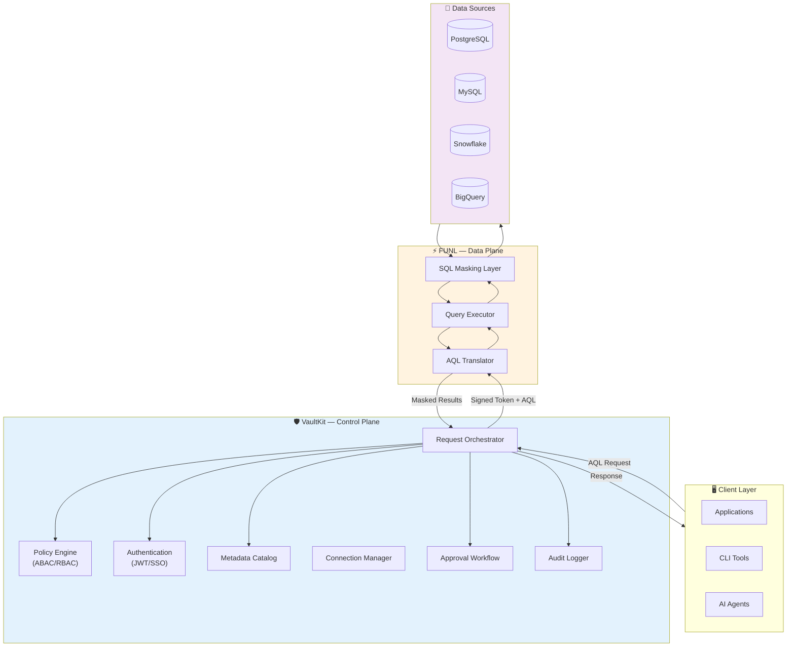

# VaultKit

[](https://opensource.org/licenses/Apache-2.0)
[]()
[]()
[](https://golang.org)
[](https://www.ruby-lang.org)

> A secure, policy-driven control plane for unified data access across heterogeneous data sources.

VaultKit provides enterprise-grade governance and security for data access, enabling applications, engineers, and AI agents to query multiple data sources through a unified, policy-controlled interface.

---

## 🎯 What is VaultKit?

VaultKit is a **control plane** that governs how data is accessed across your organization. It centralizes authentication, authorization, policy evaluation, and access control—ensuring that every data request is properly authenticated, authorized, and audited before execution.

### Core Responsibilities

- **Authentication & Authorization**: Identity verification and access control with RBAC/ABAC support
- **Policy Evaluation**: Fine-grained policies based on user attributes, data sensitivity, geographic regions, and time constraints
- **Data Masking**: Column-level masking rules (full, partial, hash) applied based on user clearance
- **Connection Management**: Centralized datasource configuration and credential management
- **Approval Workflows**: Require explicit approval for accessing sensitive datasets
- **Audit Logging**: Complete audit trail of every data access request
- **Metadata Catalog**: Automated dataset classification and schema discovery
- **Session Tokens**: Short-lived, cryptographically-signed tokens for Zero-Trust security

---

## ⚡ What is FUNL?

FUNL (Functional Universal Query Language) is the **data plane and execution engine** that powers VaultKit's query capabilities. While VaultKit decides *if* and *how* data can be accessed, FUNL handles the actual execution.

### Core Responsibilities

- **AQL Translation**: Converts VaultKit's Abstract Query Language (AQL) into native query languages
- **Multi-Engine Support**: Executes queries against PostgreSQL, MySQL, Snowflake, BigQuery, and more
- **SQL Masking Engine**: Applies column-level masking at the SQL execution layer
- **Query Execution**: Handles parameterized queries with injection prevention
- **Result Sanitization**: Returns masked and filtered results back to VaultKit
- **JWT Authentication**: Only accepts cryptographically-signed requests from VaultKit

FUNL is designed to be lightweight, stateless, and horizontally scalable—making it ideal for high-throughput data access scenarios.

---

## 🔄 AQL to Native Query Translation

AQL (Access Query Language) is a structured JSON format that describes **what** to fetch, not **how**. This abstraction allows VaultKit to enforce policies consistently across different database engines.

### AQL Structure

AQL is a structured JSON specification with the following top-level fields:

```json
{
  "source_table": "table_name",
  "columns": ["field1", "field2"],
  "joins": [],
  "aggregates": [],
  "filters": [],
  "group_by": [],
  "having": [],
  "order_by": null,
  "limit": 0,
  "offset": 0
}
```

### Translation Examples

**Simple Query:**
```json
{
  "source_table": "customers",
  "columns": ["email", "country", "revenue"],
  "filters": [
    { "field": "country", "operator": "eq", "value": "US" },
    { "field": "revenue", "operator": "gt", "value": 10000 }
  ],
  "limit": 100
}
```

**FUNL Translation → PostgreSQL:**
```sql
SELECT email, country, revenue
FROM customers
WHERE country = $1 AND revenue > $2
LIMIT 100
```

**FUNL Translation → MySQL:**
```sql
SELECT `email`, `country`, `revenue`
FROM `customers`
WHERE `country` = ? AND `revenue` > ?
LIMIT 100
```

**Complex Query with JOINs and Aggregates:**
```json
{
  "source_table": "users",
  "joins": [
    {
      "type": "LEFT",
      "table": "orders",
      "left_field": "users.id",
      "right_field": "orders.user_id"
    }
  ],
  "columns": ["users.email", "users.username"],
  "aggregates": [
    {
      "func": "sum",
      "field": "orders.amount",
      "alias": "total_spent"
    }
  ],
  "group_by": ["users.email", "users.username"],
  "having": [
    {
      "operator": "gt",
      "field": "SUM(orders.amount)",
      "value": 500
    }
  ],
  "order_by": {
    "column": "total_spent",
    "direction": "DESC"
  },
  "limit": 10
}
```

**FUNL Translation → PostgreSQL:**
```sql
SELECT users.email, users.username, SUM(orders.amount) AS total_spent
FROM users
LEFT JOIN orders ON users.id = orders.user_id
GROUP BY users.email, users.username
HAVING SUM(orders.amount) > $1
ORDER BY total_spent DESC
LIMIT 10
```

### Advanced Features

**Complex Filtering with OR Logic:**
```json
{
  "source_table": "users",
  "columns": ["id", "email", "role"],
  "filters": [
    {
      "logic": "OR",
      "conditions": [
        { "field": "users.role", "operator": "eq", "value": "admin" },
        { "field": "users.role", "operator": "eq", "value": "manager" }
      ]
    },
    { "field": "orders.amount", "operator": "gt", "value": 100 }
  ]
}
```

**Translation:**
```sql
SELECT id, email, role
FROM users
WHERE (users.role = $1 OR users.role = $2) AND orders.amount > $3
```

**Supported Operators:**
- Comparison: `eq`, `neq`, `gt`, `lt`, `gte`, `lte`
- Pattern matching: `like`
- Set operations: `in`
- Null checks: `is_null`, `is_not_null`

**Supported Aggregations:**
- `sum`, `count`, `avg`, `min`, `max`

**Supported JOINs:**
- `INNER`, `LEFT`, `RIGHT`, `FULL`

### SQL-Level Masking

FUNL's **Masking Dialect System** applies transformations directly in SQL based on VaultKit's policy decisions:

| Masking Type | PostgreSQL | MySQL | Snowflake |
|-------------|------------|-------|-----------|
| **Full** | `'*****' AS email` | `'*****' AS email` | `'*****' AS email` |
| **Partial** | `CONCAT(LEFT(email, 3), '****')` | `CONCAT(LEFT(email, 3), '****')` | `CONCAT(LEFT(email, 3), '****')` |
| **Hash** | `ENCODE(SHA256(email::bytea), 'hex')` | `SHA2(email, 256)` | `SHA2(email, 256)` |

---

## 🏗️ Architecture



### Component Breakdown

#### VaultKit (Control Plane)

- **Request Orchestrator**: Routes and manages the lifecycle of data access requests
- **Policy Engine**: Evaluates ABAC/RBAC rules with support for sensitivity levels, regions, and time constraints
  - **Policy Priority System**: `deny` > `require_approval` > `mask` > `allow`
  - **Match Rules**: Dataset-based, field sensitivity, categories, specific field names
  - **Context Awareness**: User role, clearance level, region, environment, time windows
- **Authentication Service**: Handles user identity via JWT, OAuth, or SSO integration
- **Metadata Catalog**: Auto-discovers and classifies datasets with sensitivity tagging
- **Connection Manager**: Manages datasource credentials (supports VaultKit store, HashiCorp Vault, AWS Secrets Manager)
- **Approval Workflow**: Implements multi-stage approval for sensitive data access
- **Audit Logger**: Records every request to pluggable sinks (SQLite, PostgreSQL, S3, etc.)

#### FUNL (Data Plane)
- **AQL Translator**: Parses AQL and generates engine-specific SQL with proper escaping
- **Query Executor**: Maintains connection pools and executes parameterized queries
- **SQL Masking Layer**: Injects masking functions into SELECT statements based on policy
- **Engine Plugins**: Extensible architecture for adding new database engines

---

## ✨ Key Features

### VaultKit (Control Plane)

| Feature | Description |
|---------|-------------|
| **AQL Orchestration** | Vendor-neutral query language prevents SQL injection and enables policy enforcement |
| **Policy Engine** | Attribute-based access control with support for clearance levels, regions, sensitivity tags, and time windows |
| **Policy Priority System** | Hierarchical decision making: `deny` > `require_approval` > `mask` > `allow` |
| **Field-Level Policies** | Match rules based on dataset name, field sensitivity, categories (pii, financial, etc.), or specific field names |
| **Context-Aware Rules** | Policies evaluate requester role, clearance level, region, environment, and time constraints |
| **Approval Workflows** | Require manager/security approval for accessing PII, financial data, or production environments |
| **Zero-Trust Sessions** | Short-lived, cryptographically-signed tokens with automatic expiration |
| **Credential Abstraction** | Never expose database credentials to users—supports multiple secret backends |
| **Auto-Discovery** | Automatically scans datasources to build metadata catalog with column-level sensitivity tagging |
| **Comprehensive Auditing** | Every query logged with user identity, timestamp, policy decisions, and results metadata |
| **CLI & SDK** | Rich command-line tools (`vkit`) and programmatic SDK for integration |

### FUNL (Data Plane)

| Feature | Description |
|---------|-------------|
| **Multi-Engine Translation** | Supports PostgreSQL, MySQL, Snowflake, BigQuery with identical AQL interface |
| **SQL-Level Masking** | Masking applied during query execution—no post-processing overhead |
| **Injection Prevention** | All queries use parameterized execution with proper type binding |
| **Raw SQL Support** | Supports raw SQL for schema introspection and admin operations (policy-controlled) |
| **Horizontal Scaling** | Stateless design enables running multiple FUNL instances behind a load balancer |
| **JWT Verification** | Only executes queries signed by VaultKit's private key |

---

## 🚀 Getting Started

### Prerequisites

- **Ruby** 3.1+ (for VaultKit CLI)
- **Go** 1.21+ (for FUNL execution engine)
- **Docker** (optional, for containerized deployment)
- Access credentials for at least one supported datasource

### Installation

#### 1. Install VaultKit CLI

```bash
git clone https://github.com/yourorg/vaultkitcli.git
cd vaultkitcli
gem build vaultkitcli.gemspec
gem install ./vaultkitcli-0.1.0.gem
```

Verify installation:
```bash
vkit --version
vkit --help
```

#### 2. Generate Cryptographic Keys

VaultKit uses RSA key pairs for signing session tokens that FUNL validates. Generate your keys:

```bash
# Generate private key
openssl genpkey -algorithm RSA -out vaultkit_private.pem -pkeyopt rsa_keygen_bits:2048

# Extract public key
openssl rsa -pubout -in vaultkit_private.pem -out vaultkit_public.pem
```

**Set environment variables:**

```bash
export VKIT_PRIVATE_KEY="/path/to/vaultkit_private.pem"
export VKIT_PUBLIC_KEY="/path/to/vaultkit_public.pem"
export FUNL_PUBLIC_KEY="/path/to/vaultkit_public.pem"  # FUNL uses the same public key
```

Add these to your `~/.bashrc` or `~/.zshrc` for persistence.

⚠️ **Security Note**: Keep your private key secure and never commit it to version control. Add `*.pem` to your `.gitignore`.

#### 3. Start FUNL Execution Engine

**Using Docker:**
```bash
docker compose up -d
```

**From Source:**
```bash
git clone https://github.com/yourorg/funl.git
cd funl
go build -o funl ./cmd/funl
./funl serve --port 8080
```

FUNL will be available at `http://localhost:8080`

**Set FUNL URL environment variable:**
```bash
export FUNL_URL="http://localhost:8080"
```

#### 4. Initialize VaultKit

```bash
# Authenticate with VaultKit
vkit login

# This creates ~/.vkit/credentials.json with your encrypted session
```

#### 5. Register a Datasource

```bash
vkit datasource add \
  --id production_db \
  --engine postgres \
  --username analyst_readonly \
  --password <secure-password> \
  --config '{
    "host": "db.example.com",
    "port": 5432,
    "database": "analytics",
    "ssl_mode": "require"
  }'
```

Supported engines: `postgres`, `mysql`, `snowflake`, `bigquery`

#### 6. Scan Datasource Metadata

```bash
vkit scan --datasource production_db
```

This auto-discovers tables, columns, data types, and applies sensitivity classification.

#### 7. Submit an AQL Request

```bash
vkit request --datasource production_db --aql '{
  "source_table": "customers",
  "columns": ["customer_id", "email", "country", "revenue"],
  "filters": [
    { "field": "country", "operator": "eq", "value": "US" },
    { "field": "revenue", "operator": "gt", "value": 50000 }
  ],
  "limit": 50
}'
```

#### 7. Fetch Results

```bash
# VaultKit returns a grant ID for fetching results
vkit fetch --grant grant_abc123xyz
```

---

## 🎯 Use Cases

### 1. **Secure AI Agent Access**
Enable LLM-powered agents to query production databases without exposing credentials. VaultKit enforces policies that restrict which tables and columns AI agents can access, with automatic masking of sensitive fields.

**Policy Example:**
```yaml
id: ai_agent_restrictions
match:
  fields:
    category: pii

context:
  requester_role: ai_agent
  environment: production

action:
  mask: true
  reason: "PII must be masked for AI agents"
  ttl: "15m"
```

**How it works:**
- AI agents receive short-lived session tokens (15 minutes)
- All PII fields automatically masked before results are returned
- Agents can still analyze patterns without accessing raw sensitive data

### 2. **Cross-Region Compliance (GDPR, CCPA, HIPAA)**
Automatically mask or deny access to sensitive fields based on user location and data residency requirements.

**Policy Example:**
```yaml
id: gdpr_protection
match:
  dataset: customers
  fields:
    category: pii

context:
  requester_region: US
  dataset_region: EU

action:
  deny: true
  reason: "Cross-region access forbidden due to GDPR"
```

**How it works:**
- US-based analysts attempting to query EU customer data are automatically denied
- Policy engine evaluates both requester and dataset regions
- Audit log captures denied attempts for compliance reporting

### 3. **Just-In-Time Access (Break-Glass)**
Developers can request temporary elevated access to production data with automatic approval workflows and audit trails.

**Policy Example:**
```yaml
id: financial_requires_approval
match:
  fields:
    category: financial

context:
  environment: production

action:
  require_approval: true
  approver_role: finance_manager
  reason: "Financial data access requires approval"
  ttl: "1h"
```

**CLI Usage:**
```bash
vkit request --datasource prod_db --approval-required \
  --reason "Investigating customer support ticket #12345" \
  --duration "2h"
```

**How it works:**
- Request is held pending approval from designated role
- Approver receives notification with request context
- Upon approval, requester gets time-limited access token
- All access attempts logged to audit trail

### 4. **Data Engineering Without Credential Sprawl**
Data scientists and analysts use AQL to query multiple datasources without managing individual credentials for each system.

### 5. **Universal Query Layer for Microservices**
Applications use AQL instead of engine-specific SQL, allowing transparent migration between database systems without code changes.

**Policy Example:**
```yaml
id: time_restricted_access
match:
  dataset: audit_logs

context:
  environment: production
  time:
    start: "08:00"
    end: "18:00"
    timezone: "America/Toronto"

action:
  allow: true
  reason: "Access allowed during business hours"
  ttl: "1h"
```

**Benefits:**
- Database-agnostic application code
- Migrate from PostgreSQL → Snowflake without app changes
- Centralized access policies across all microservices
- Time-based access windows for compliance

---

## 🛠️ Technical Requirements

### System Requirements

- **OS**: Linux, macOS, or Windows (WSL2)
- **Memory**: Minimum 2GB RAM (4GB+ recommended for production)
- **Network**: Outbound connectivity to datasources

### Required Environment Variables

| Variable | Description | Example |
|----------|-------------|---------|
| `VKIT_PRIVATE_KEY` | Path to VaultKit's RSA private key (for signing tokens) | `/etc/vaultkit/private.pem` |
| `VKIT_PUBLIC_KEY` | Path to VaultKit's RSA public key | `/etc/vaultkit/public.pem` |
| `FUNL_PUBLIC_KEY` | Path to public key for FUNL to verify tokens | `/etc/vaultkit/public.pem` |
| `FUNL_URL` | URL where FUNL execution engine is running | `http://localhost:8080` |

**Setup Example:**
```bash
# Generate keys
openssl genpkey -algorithm RSA -out vaultkit_private.pem -pkeyopt rsa_keygen_bits:2048
openssl rsa -pubout -in vaultkit_private.pem -out vaultkit_public.pem

# Set environment variables
export VKIT_PRIVATE_KEY="$(pwd)/vaultkit_private.pem"
export VKIT_PUBLIC_KEY="$(pwd)/vaultkit_public.pem"
export FUNL_PUBLIC_KEY="$(pwd)/vaultkit_public.pem"
export FUNL_URL="http://localhost:8080"
```

### Supported Data Sources

| Engine | AQL Translation | Query Execution | Column Masking | Schema Introspection |
|--------|----------------|-----------------|----------------|---------------------|
| **PostgreSQL** | ✅ | ✅ | ✅ | ✅ |
| **MySQL** | ✅ | ✅ | ✅ | ✅ |
| **Snowflake** | ✅ | ✅ | ✅ | ✅ |
| **BigQuery** | ✅ | ✅ | ✅ | ✅ |
| **Redshift** | 🚧 Planned | 🚧 Planned | 🚧 Planned | 🚧 Planned |
| **MongoDB** | 🚧 Planned | 🚧 Planned | 🚧 Planned | 🚧 Planned |

### Dependencies

#### VaultKit CLI (Ruby)
- `jwt` - Token generation and verification
- `httparty` - HTTP client for FUNL communication
- `thor` - CLI framework

#### FUNL (Go)
- `github.com/lib/pq` - PostgreSQL driver
- `github.com/go-sql-driver/mysql` - MySQL driver
- `github.com/snowflakedb/gosnowflake` - Snowflake driver
- `cloud.google.com/go/bigquery` - BigQuery client

---

## 📚 Documentation & Support

| Resource | Link |
|----------|------|
| **📖 Full Documentation** | Coming soon |
| **📘 AQL Specification** | [AQL Syntax Guide](./docs/AQL_SPECIFICATION.md) |
| **🛡️ Policy Reference** | [Policy Template & Examples](./docs/POLICY_GUIDE.md) |
| **💬 Slack Community** | Coming soon |
| **🐛 Issue Tracker** | [GitHub Issues](https://github.com/yourorg/vaultkit/issues) |
| **📧 Security Reports** | security@vaultkit.io |
| **🤝 Contributing Guide** | [CONTRIBUTING.md](./CONTRIBUTING.md) |

---

## 🤝 Contributing

We welcome contributions from the community! Here's how to get started:

1. **Fork** the repository
2. **Create** a feature branch (`git checkout -b feature/amazing-feature`)
3. **Commit** your changes (`git commit -m 'Add amazing feature'`)
4. **Push** to the branch (`git push origin feature/amazing-feature`)
5. **Open** a Pull Request

### Development Guidelines

- All PRs must include unit tests for new functionality
- Translation logic must support all existing engines
- Follow Go and Ruby style guides (enforced by CI linters)
- Update documentation for user-facing changes

Our CI/CD pipeline automatically verifies:
- ✅ Translation correctness across all supported engines
- ✅ Query execution safety (injection prevention)
- ✅ Masking function accuracy
- ✅ Policy evaluation logic

---

## 📄 License

VaultKit is released under the [Apache License 2.0](LICENSE).

```
Copyright 2024 VaultKit Contributors

Licensed under the Apache License, Version 2.0 (the "License");
you may not use this file except in compliance with the License.
You may obtain a copy of the License at

    http://www.apache.org/licenses/LICENSE-2.0

Unless required by applicable law or agreed to in writing, software
distributed under the License is distributed on an "AS IS" BASIS,
WITHOUT WARRANTIES OR CONDITIONS OF ANY KIND, either express or implied.
See the License for the specific language governing permissions and
limitations under the License.
```

---

## 🌟 Star History

If you find VaultKit useful, please consider giving us a star on GitHub! ⭐

---

**Built with ❤️ by the VaultKit team**